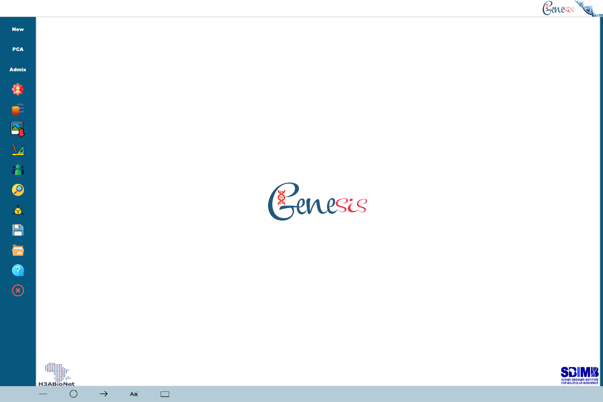

# Welcome to Genesis Page!

<!-- This site was created using [**Docsify**](https://docsify.js.org), which is an open source documentation site generator, and imported in GitHub page. This site was created for [**Opensource.com**](https://opensource.com) demo. -->

Genesis is a program created for scientists to generate PCA (Principal Component Analysis) and structure/admixture graphs from data outputted by common tools such as eigenstrat [Pritchard et al. 2000] and the SNPRelate [Zheng et al 2012] package for PCAs and Admixture [Alexander et al. 2009] and CLUMPP [Jakobsson and Rosenberg 2007] for admixtures.

Genesis was developed with user-friendliness in mind as other tools can be complex to use and lack certain features. All elements of the graphs that would need to be edited can be done so using a graphical user Interface where the graphs themselves are interactive and different elements can be viewed and changed at the click of the mouse. All this saves the time that scientists would rather be spending doing more important things.

Principal Component Analysis is a mathematical and statistical procedure that can used to analyse genotype data. The differences between samples’ genotype data can be used to project each sample into a p-dimensional space, where the p axes are uncorrelated. For realistic data, typically p is 4 or less and often only the most important two demsnions are used. Programs such as eigenstrat produce the the PCs, and Genesis produces them.
An example is found below:

(./images/pca-example.png)

